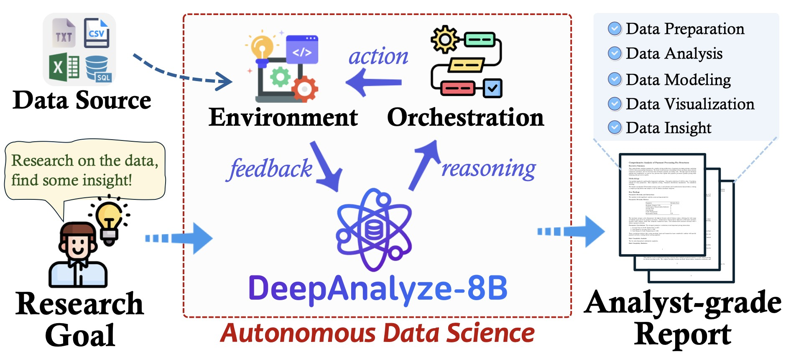

<p align="center" width="100%">

</p>

# DeepAnalyze: Agentic Large Language Models for Autonomous Data Science
[](https://arxiv.org/abs/2510.16872)
[](https://ruc-deepanalyze.github.io/)
[](https://huggingface.co/RUC-DataLab/DeepAnalyze-8B)
[](https://huggingface.co/datasets/RUC-DataLab/DataScience-Instruct-500K)
[](https://github.com/ruc-datalab/DeepAnalyze)
  [](./assets/wechat.jpg) 

[](https://x.com/BrianRoemmele/status/1981015483823571352) [](https://x.com/Dr_Singularity/status/1981010771338498241) [](https://x.com/Gorden_Sun/status/1980573407386423408) [](https://x.com/aigclink/status/1980554517126246642) [](https://x.com/Python_Dv/status/1980667557318377871) [](https://x.com/shao__meng/status/1980623242114314531) 


> **Authors**: **[Shaolei Zhang](https://zhangshaolei1998.github.io/), [Ju Fan*](http://iir.ruc.edu.cn/~fanj/), [Meihao Fan](https://scholar.google.com/citations?user=9RTm2qoAAAAJ), [Guoliang Li](https://dbgroup.cs.tsinghua.edu.cn/ligl/), [Xiaoyong Du](http://info.ruc.edu.cn/jsky/szdw/ajxjgcx/jsjkxyjsx1/js2/7374b0a3f58045fc9543703ccea2eb9c.htm)**
>
> Renmin University of China, Tsinghua University


**DeepAnalyze** is the first agentic LLM for autonomous data science. It can autonomously complete a wide range of data-centric tasks without human intervention, supporting:
- 🛠 **Entire data science pipeline**: Automatically perform any data science tasks such as data preparation, analysis, modeling, visualization, and report generation.
- 🔍 **Open-ended data research**: Conduct deep research on diverse data sources, including structured data (Databases, CSV, Excel), semi-structured data (JSON, XML, YAML), and unstructured data (TXT, Markdown), and finally produce analyst-grade research reports.
- 📊 **Fully open-source**: The [model](https://huggingface.co/RUC-DataLab/DeepAnalyze-8B), [code](https://github.com/ruc-datalab/DeepAnalyze), [training data](https://huggingface.co/datasets/RUC-DataLab/DataScience-Instruct-500K), and [demo](https://huggingface.co/RUC-DataLab/DeepAnalyze-8B) of DeepAnalyze are all open-sourced, allowing you to deploy or extend your own data analysis assistant.

<p align="center" width="100%">

</p>


## 🔥 News

- **[2026.07]**: We look forward to releasing **[DeepPrep](https://arxiv.org/abs/2602.07371)**, a data-preparation companion to DeepAnalyze that turns raw tables into analysis-ready data.

  <details>
  <summary>More about DeepPrep</summary>

  **DeepPrep** is an LLM-powered agentic system for autonomous data preparation. It constructs data-preparation pipelines through execution-grounded interaction with intermediate table states and runtime feedback, helping clean, transform, and standardize raw data before downstream analysis.

  ▶️ Demo:

  https://github.com/user-attachments/assets/6b94927f-5c0c-4cfe-bc33-de56b8e459cd

  </details>

- **[2026.06.15]**: We release **[CoDA-Bench](https://github.com/ruc-datalab/CoDA-Bench)**, a benchmark for evaluating whether code agents can handle data-intensive analytical tasks, closely aligned with DeepAnalyze's target scenarios.

  <details>
  <summary>More about CoDA-Bench</summary>

  **CoDA-Bench** evaluates agents in a Linux sandbox with hundreds of data files. Given a natural-language question, an agent must discover relevant data, write executable code, and produce the final answer. It provides a benchmark setting for the same type of data discovery and code-execution challenges targeted by DeepAnalyze.

  ▶️ Demo:

  https://github.com/user-attachments/assets/34e50a62-744b-4079-8988-6a8bbfe166a0

  </details>

- **[2026.05.31]**:  **[DA-Studio](http://arxiv.org/abs/2606.31423)**, the system behind DeepAnalyze WebUI v2 (`demo/chat_v2`), has been accepted to the VLDB 2026 Demonstration Track.


- **[2026.03.16]**: Update DeepAnalyze **WebUI v2**, featuring a smoother UI, support for the **HeyWhale API**, and support for **Docker-based sandboxed code execution**. More details in [Readme](./demo/chat_v2/README.md) .

- **[2026.01.31]**: 🎉🎉🎉DeepAnalyze served as the official agent supporting the **[2026年(第19届)中国大学生计算机设计大赛大数据主题赛 (2026 (19th) China Collegiate Computer Design Contest – Big Data Track)](https://jsjds.dhu.edu.cn/2025/0322/c20379a371447/page.htm)**.

- **[2025.12.28] ANNOUNCEMENT: DeepAnalyze API Keys Are Now Available 🎉🎉🎉**  You can now apply for your API key via this [Google Form](https://forms.gle/YxVkCzczqq8jeciw9) or this [Feishu Form](https://heywhale.feishu.cn/share/base/shrcnnBRgO0x2qhx40yq4m1HxUg). For full details and usage instructions, please refer to the [Guide](./docs/DeepAnalyze_API_Key_Usage_Guide.md) or the [Feishu Wiki](https://heywhale.feishu.cn/wiki/TcVmw314liwCiKkxnttc2CnInfg).


- **[2025.11.13]**: DeepAnalyze now supports OpenAI-style API endpointsis and is accessible through the Command Line Terminal UI. Thanks to the contributor [@LIUyizheSDU](https://github.com/LIUyizheSDU/)

- **[2025.11.08]**: DeepAnalyze is now accessible through the JupyterUI, building based on [jupyter-mcp-server](https://github.com/datalayer/jupyter-mcp-server). Thanks to the contributor [@ChengJiale150](https://github.com/ChengJiale150).

- **[2025.10.28]**: We welcome all contributions, including improving the DeepAnalyze and sharing use cases (see [`CONTRIBUTION.md`](CONTRIBUTION.md)). All merged PRs will be listed as contributors.

- **[2025.10.27]**: DeepAnalyze has attracted widespread attention, gaining **1K+** GitHub stars and **200K+** Twitter views within a week.

- **[2025.10.21]**: DeepAnalyze's [paper](https://arxiv.org/abs/2510.16872), [code](https://github.com/ruc-datalab/DeepAnalyze), [model](https://huggingface.co/RUC-DataLab/DeepAnalyze-8B), [training data](https://huggingface.co/datasets/RUC-DataLab/DataScience-Instruct-500K) are released!

## 🖥 Demo

### WebUI

https://github.com/user-attachments/assets/04184975-7ee7-4ae0-8761-7a7550c5c8fe
<p align="center" width="100%">
Upload the data, DeepAnalyze can perform data-oriented deep research 🔍 and any data-centric tasks 🛠
</p>

- Clone this repo and download [DeepAnalyze-8B](https://huggingface.co/RUC-DataLab/DeepAnalyze-8B).
- Deploy DeepAnalyze-8B via vllm: `vllm serve DeepAnalyze-8B`
- Run these scripts to launch the API and interface, and then interact through the browser (http://localhost:4000):
    ```bash
    cd demo/chat/frontend
    npm install
    cd ..
    bash start.sh
    
    # stop the api and interface
    bash stop.sh
    
    # stop vllm if needed
    ```
- If you want to deploy under a specific IP, please replace localhost with your IP address in [./demo/chat/backend.py](./demo/chat/backend.py) and [./demo/chat/frontend/lib/config.ts](./demo/chat/frontend/lib/config.ts)

### WebUI v2

https://github.com/user-attachments/assets/2dd1d2aa-6fb9-4202-bc8d-cbe874844725
<p align="center" width="100%">
Upload the data, DeepAnalyze can perform data-oriented deep research 🔍 and any data-centric tasks 🛠
</p> 

- A more streamlined UI
- Added support for HeyWhale API keys
- Added support for a Docker-based sandbox code execution environment.
- The usage method is the same as WebUI.

    ```bash
    cd demo/chat_v2/frontend  
    npm install
    cd ..
    cp .env.example .env 
    bash start.sh
    # stop the api and interface
    bash stop.sh
    
    # stop vllm if needed
    ```

### JupyterUI

https://github.com/user-attachments/assets/a2335f45-be0e-4787-a4c1-e93192891c5f
<p align="center" width="100%">
Familiar with Jupyter Notebook? Try DeepAnalyze through the JupyterUI!
</p>

- This Demo runs Jupyter Lab as frontend, creating a new notebook, converting `<Analyze|Understand|Answer>` to Markdown cells, converting `<Code>` to Code cells and executing them as `<Execute>`.
- Go to [demo/jupyter](./demo/jupyter) to see more and try!
- 👏Thanks a lot to the contributor [@ChengJiale150](https://github.com/ChengJiale150).

### CLI

https://github.com/user-attachments/assets/018acae5-b979-4143-ae1e-5b74da453c1d
<p align="center" width="100%">
Try DeepAnalyze through the command-line interface
</p>

- Deploy DeepAnalyze-8B via vllm: `vllm serve DeepAnalyze-8B`

- Start the API server and launch the CLI interface:
    ```bash
    cd API
    python start_server.py  # In one terminal
    
    cd demo/cli
    python api_cli.py       # In another terminal (English)
    # or
    python api_cli_ZH.py    # In another terminal (Chinese)
    ```
    
- The CLI provides a Rich-based beautiful interface with file upload support and real-time streaming responses.

- Supports both English and Chinese interfaces .

    

> [!TIP]
>
> Clone this repository to deploy DeepAnalyze locally as your data analyst, completing any data science tasks without any workflow or closed-source APIs.
>
> 🔥 The UI of the demo is an initial version. Welcome to further develop it, and we will include you as a contributor.

## 🚀 Quick Start

### 🔑 **Use the DeepAnalyze API**

**API keys are now available!**

To request your key, please fill out one of the following application forms:
*   **[Primary Form (Google)](https://forms.gle/YxVkCzczqq8jeciw9)**
*   **[Alternative Form (Feishu)](https://heywhale.feishu.cn/share/base/shrcnnBRgO0x2qhx40yq4m1HxUg)**

**📚 For comprehensive usage instructions, please refer to the API guide:**

*   **[Documentation](./docs/DeepAnalyze_API_Key_Usage_Guide.md)**
*   **[Feishu Wiki](https://heywhale.feishu.cn/wiki/TcVmw314liwCiKkxnttc2CnInfg)**


### Model Download

Download model in  [RUC-DataLab/DeepAnalyze-8B · Hugging Face](https://huggingface.co/RUC-DataLab/DeepAnalyze-8B)  or  [DeepAnalyze-8B · 模型库](https://www.modelscope.cn/models/RUC-DataLab/DeepAnalyze-8B/summary)

#### 📊 Memory Configuration Recommended Parameters Table

| GPU Memory | Model Type | Recommended max-model-len | Use FP8 KV Cache |
|------------|------------|--------------------------|-----------------------|
| **16GB** | 8-bit Quantized | 8192 | ✓ |
| **16GB** | 4-bit Quantized | 49152 | ✓ |
| **24GB** | Original Model | 16384 | ✓ |
| **24GB** | 8-bit Quantized | 98304 | ✓ |
| **24GB** | 4-bit Quantized | 131072 | ✓ |
| **40GB** | Original Model | 131072 | ✓ |
| **40GB** | 8-bit Quantized | 131072 |  |
| **80GB** | Original Model | 131072 |  |

To obtain the quantized model, you can use `./quantize.py` .

#### 🚀 vLLM Launch Command Template

##### General Command Template
```bash
python -m vllm.entrypoints.openai.api_server \
  --model <model_path> \
  --served-model-name DeepAnalyze-8B \
  --max-model-len <select_from_table_above> \
  --gpu-memory-utilization 0.95 \
  --port 8000 \
  <add_fp8_if_required> \
  --trust-remote-code
```

##### Command Examples by Scenario

**Scenario 1: 16GB GPU Memory Users (Recommended: 4-bit Quantized Version)**

```bash
python -m vllm.entrypoints.openai.api_server \
  --model /path/to/deepanalyze/4bit \
  --served-model-name DeepAnalyze-8B \
  --max-model-len 49152 \
  --gpu-memory-utilization 0.95 \
  --port 8000 \
  --kv-cache-dtype fp8 \
  --trust-remote-code
```

**Scenario 2: 24GB GPU Memory Users (For Maximum Context Length)**

```bash
python -m vllm.entrypoints.openai.api_server \
  --model /path/to/deepanalyze/4bit \
  --served-model-name DeepAnalyze-8B \
  --max-model-len 131072 \
  --gpu-memory-utilization 0.95 \
  --port 8000 \
  --kv-cache-dtype fp8 \
  --trust-remote-code
```

**Scenario 3: 80GB GPU Memory Users (Best Performance)**

```bash
python -m vllm.entrypoints.openai.api_server \
  --model /path/to/original/model \
  --served-model-name DeepAnalyze-8B \
  --max-model-len 131072 \
  --gpu-memory-utilization 0.95 \
  --port 8000 \
  --trust-remote-code
```

#### Quick Selection Guide

- **Limited Memory (<24GB)**: Use 4-bit Quantized Version + FP8 KV Cache
- **Balanced Configuration (24-40GB)**: Choose model type based on requirements
- **Sufficient Memory (≥40GB)**: Use Original Model for best precision

After launching, the API service can be accessed via `http://localhost:8000/v1/completions`.

### Requirements

- Install packages: `torch`, `transformers`, `vllm>=0.8.5`
    ```bash
    conda create -n deepanalyze python=3.12 -y
    conda activate deepanalyze
    pip install -r requirements.txt
    
    # For training
    (cd ./deepanalyze/ms-swift/ && pip install -e .)
    (cd ./deepanalyze/SkyRL/ && pip install -e .)
    ```
- [`requirements.txt`](requirements.txt) lists the minimal dependencies required for DeepAnalyze inference.
For training, please refer to [`./deepanalyze/ms-swift/requirements.txt`](./deepanalyze/ms-swift/requirements.txt) and [`./deepanalyze/SkyRL/pyproject.toml`](./deepanalyze/SkyRL/pyproject.toml)
- We recommend separating the inference and training environments to avoid dependency conflicts.

### Command Interaction

- Deploy DeepAnalyze-8B via vllm: `vllm serve DeepAnalyze-8B`

- Run these scripts for any data science tasks:
  - You can specify **any data science tasks**, including specific data tasks and open-ended data research.
  - You can specify **any number of data sources**, and DeepAnalyze will automatically explore them.
  - You can specify **any type of data sources**, e.g., structured data (Databases, CSV, Excel), semi-structured data (JSON, XML, YAML), and unstructured data (TXT, Markdown)

  ```python
  from deepanalyze import DeepAnalyzeVLLM
  
  prompt = """# Instruction
  Generate a data science report.
  
  # Data
  File 1: {"name": "bool.xlsx", "size": "4.8KB"}
  File 2: {"name": "person.csv", "size": "10.6KB"}
  File 3: {"name": "disabled.xlsx", "size": "5.6KB"}
  File 4: {"name": "enlist.csv", "size": "6.7KB"}
  File 5: {"name": "filed_for_bankrupcy.csv", "size": "1.0KB"}
  File 6: {"name": "longest_absense_from_school.xlsx", "size": "16.0KB"}
  File 7: {"name": "male.xlsx", "size": "8.8KB"}
  File 8: {"name": "no_payment_due.xlsx", "size": "15.6KB"}
  File 9: {"name": "unemployed.xlsx", "size": "5.6KB"}
  File 10: {"name": "enrolled.csv", "size": "20.4KB"}"""
  
  workspace = "/home/u2023000922/zhangshaolei/deepanalyze_public/DeepAnalyze/example/analysis_on_student_loan/"
  
  deepanalyze = DeepAnalyzeVLLM(
      "/fs/fast/u2023000922/zhangshaolei/checkpoints/deepanalyze-8b/"
  )
  answer = deepanalyze.generate(prompt, workspace=workspace)
  print(answer["reasoning"])
  ```
  You shoud get a deep research report, which can be rendered as a PDF.:
  ```text
  # Comprehensive Analysis of Student Enrollment Patterns and Institutional Transfers
  
  ## Introduction and Research Context
  
  The analysis of student enrollment patterns represents a critical area of educational research with significant implications for institutional planning, resource allocation, and student support services. This comprehensive study examines a comprehensive dataset encompassing 1,194 enrollment records across six educational institutions, merged with supplementary demographic, financial, and employment status data. The research employs advanced analytical techniques including network analysis, predictive modeling, and temporal pattern recognition to uncover both macro-level institutional trends and micro-level student mobility patterns. The dataset's longitudinal nature, spanning fifteen months of enrollment records, provides unique insights into the complex dynamics of student pathways through higher education systems.
  
  Our methodological approach combines quantitative analysis of enrollment durations, transfer probabilities, and financial indicators with qualitative ...
  
  The research contributes to the growing body of literature on student mobility by providing empirical evidence of institutional transfer networks and their relationship to student outcomes...
  .....
  ```
  <p align="center" width="100%">
    
  </p>

  > For more examples and task completion details, please refer to [DeepAnalyze's homepage](https://ruc-deepanalyze.github.io/).

### API
- You can build an OpenAI-Style API, using this script (note to change `MODEL_PATH = "DeepAnalyze-8B"` in [API/config.py](API/config.py) to your vllm model name):

  ```
  python API/start_server.py
  ```

- API usage :

  ```
  FILE_RESPONSE=$(curl -s -X POST "http://localhost:8200/v1/files" \
      -F "file=@data.csv" \
      -F "purpose=file-extract")
  
  FILE_ID=$(echo $FILE_RESPONSE | jq -r '.id')
  
  curl -X POST http://localhost:8200/v1/chat/completions \
       -H "Content-Type: application/json" \
       -d "{
          \"model\": \"DeepAnalyze-8B\",
          \"messages\": [
            {
              \"role\": \"user\",
              \"content\": \"Generate a data science report.\",
              \"file_ids\": [\"$FILE_ID\"]
            }
          ]
        }"
  # wait for a while
  ```
  
- Refer to API/README.md for details.

## 🎈 Develop Your Own DeepAnalyze

### 1. Download Model and Training Data
- Download [DeepSeek-R1-0528-Qwen3-8B](https://huggingface.co/deepseek-ai/DeepSeek-R1-0528-Qwen3-8B). Or you can directly finetune based on [DeepAnalyze-8B](https://huggingface.co/RUC-DataLab/DeepAnalyze-8B).

  - If you use DeepSeek-R1-0528-Qwen3-8B as the base model, you should add the special tokens, using:

    ```shell
    MODEL_PATH=path_to_DeepSeek-R1-0528-Qwen3-8B
    SAVE_PATH=path_to_save_DeepSeek-R1-0528-Qwen3-8B-addvocab
    
    python deepanalyze/add_vocab.py \
      --model_path "$MODEL_PATH" \
      --save_path "$SAVE_PATH" \
      --add_tags
    ```

- Download training data [DataScience-Instruct-500K](https://huggingface.co/datasets/RUC-DataLab/DataScience-Instruct-500K).
  
  - unzip `DataScience-Instruct-500K/RL/data.zip`


### 2. Curriculum-based Agentic Training
- Single-ability Fine-tuning: [./scripts/single.sh](./scripts/single.sh)
- Multi-ability Agentic Training (cold start): [./scripts/multi_coldstart.sh](./scripts/multi_coldstart.sh)
- Multi-ability Agentic Training (RL): [./scripts/multi_rl.sh](./scripts/multi_rl.sh)

### 3. Evaluation
- We have unified the evaluation of most existing data science benchmarks using vLLM (with more being continuously added...). You can directly follow the introduction in [./playground](./playground) to quickly evaluate DeepAnalyze or your own agent.


## 👏 Contribution
> We welcome all forms of contributions, and merged PRs will be listed as contributors. 
### Contribution on Code and Model

- We welcome all forms of contributions on DeepAnalyze's code, model and UI, such as Docker packaging, DeepAnalyze model conversion and quantization, and submitting DeepAnalyze workflows based on closed-source LLMs. 
- You can submit a pull request directly.
- Please refer to the [Developer Guides](https://matchbench.github.io/md_file/DeveloperGuides.html) for contribution guidelines.

### Contribution on Case Study

- We also especially encourage you to share your use cases and feedback when using DeepAnalyze; these are extremely valuable for helping us improve DeepAnalyze.
- You can place your use cases in a new folder under [`.example/`](.example/). We recommend following the folder structure of [`.example/analysis_on_student_loan/`](.example/analysis_on_student_loan/), which includes three parts:
    - `data/`: stores the uploaded files
    - `prompt.txt`: input instructions
    - `README.md`: documentation. We suggest including the input, DeepAnalyze’s output, outputs from other closed-source LLMs (optional), and your evaluation/comments of the case.
- DeepAnalyze only has 8B parameters, so we also welcome examples where DeepAnalyze performs slightly worse than the closed-source LLMs — this will help us improve DeepAnalyze.

## 🤝 Acknowledgement

- **Training Frameworks:** [ms-swift](https://github.com/modelscope/ms-swift), [SkyRL](https://github.com/NovaSky-AI/SkyRL)

- **Sources of Training Data:** [Reasoning-Table](https://github.com/MJinXiang/Reasoning-Table), [Spider](https://yale-lily.github.io/spider), [BIRD](https://bird-bench.github.io/), [DABStep](https://huggingface.co/blog/dabstep)

 - **API Key & Related Services: HeyWhale Community** .

   **HeyWhale Community (www.heywhale.com) is a world-leading Chinese hands-on AI community. By providing massive data resources, practical cases, learning materials, and a wide range of AI training activities, it brings together nearly one million AI practitioners and enthusiasts to share insights, exchange ideas, collaborate, and rapidly advance their skills through practice.**


## 🖋 Citation

If this repository is useful for you, please cite as:

```
@misc{deepanalyze,
      title={DeepAnalyze: Agentic Large Language Models for Autonomous Data Science}, 
      author={Shaolei Zhang and Ju Fan and Meihao Fan and Guoliang Li and Xiaoyong Du},
      year={2025},
      eprint={2510.16872},
      archivePrefix={arXiv},
      primaryClass={cs.AI},
      url={https://arxiv.org/abs/2510.16872}, 
}
```

If you have any questions, please feel free to submit an issue or contact `zhangshaolei98@ruc.edu.cn`.

## 🌟 Misc

Welcome to join the [DeepAnalyze WeChat group](./assets/wechat.jpg), chat and share ideas with others!

<p align="left" width="100%">

</p>

If you like DeepAnalyze, give it a GitHub Star ⭐. 

[](https://www.star-history.com/#ruc-datalab/DeepAnalyze&type=date&legend=top-left)
