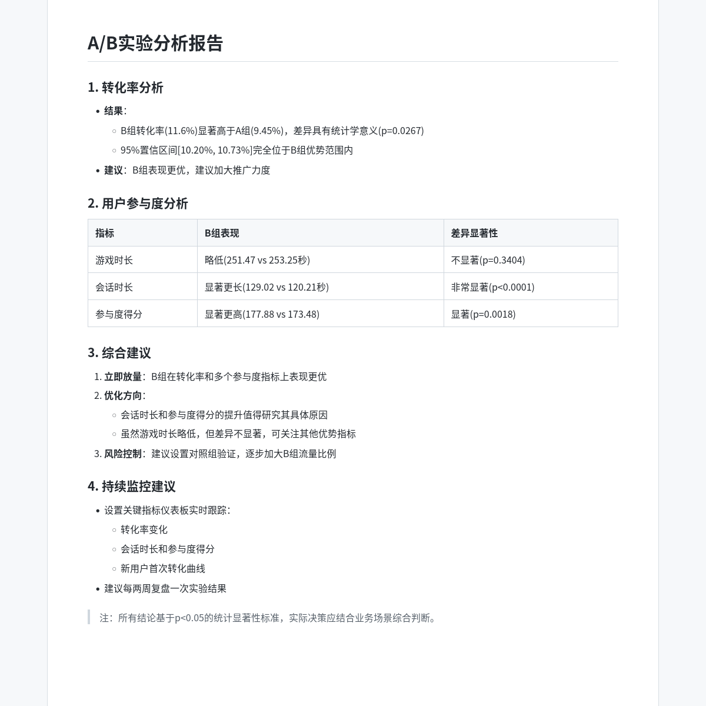

# DeepAnalyze-StatASkills

DeepAnalyze-StatASkills integrates the statistical toolkit from **StatABench** into the **DeepAnalyze** data science agent framework.

It is built on the [DeepAnalyze paper](https://arxiv.org/abs/2510.16872) and the [StatABench paper](https://arxiv.org/abs/2606.22977).

The goal is to let DeepAnalyze call a stable statistical toolkit during code execution instead of repeatedly re-implementing statistical tests, regression models, time-series methods, survival analysis, A/B testing, and causal inference from scratch.

```python
from stataskills import run_tool, list_tools, tool_help

df = run_tool("read_csv", file="hospital_stay.csv")
result = run_tool(
    "multivariable_linear_regression",
    data=df,
    y_col="Length_of_Stay_days",
    x_cols=["Patient_Age", "Severity_Score", "Is_Surgical"],
)
```

## Repository Layout

```text
DeepAnalyze/          # Upstream DeepAnalyze API and WebUI v2 source
stataskills_demo/     # stataskills package, datasets, prompts, reports, and demo runner
docs/assets/          # README preview assets
```

Only one DeepAnalyze framework file is changed for this integration: `DeepAnalyze/API/utils.py`. It injects an instruction telling the model to prefer `stataskills.run_tool(...)` for statistical work.

The bundled upstream `DeepAnalyze/README.md` is kept for attribution and reference, but some upstream demos mentioned there, such as `demo/cli`, are not included in this release package. The supported non-Web entrypoint in this repository is the OpenAI-compatible API under `DeepAnalyze/API`.

## StatASkills

`stataskills` packages selected StatABench statistical functions as a Python toolkit for code-execution agents.

Primary interfaces:

```python
from stataskills import run_tool, list_tools, tool_help
```

Covered capabilities include:

- data loading, descriptive statistics, missing-value checks, and outlier detection
- correlation analysis and hypothesis testing
- linear regression, multivariable regression, GLM, and robust regression
- time-series stationarity tests and STL decomposition
- Kaplan-Meier, log-rank test, and Cox model
- A/B testing, bootstrap confidence intervals, and power analysis
- Bayesian analysis and causal inference, including DID, PSM, and synthetic control

## Quick Start

### 1. Install Dependencies

```bash
cd DeepAnalyze
pip install -r requirements.txt

cd ../stataskills_demo
pip install -e ".[full]"
```

### 2. Start the Model Service

DeepAnalyze/API expects an OpenAI-compatible model endpoint at `http://localhost:8000/v1`.

```bash
vllm serve RUC-DataLab/DeepAnalyze-8B \
  --host 0.0.0.0 \
  --port 8000
```

You can also replace `RUC-DataLab/DeepAnalyze-8B` with a local model path.

### 3. Start the DeepAnalyze API

In another terminal:

```bash
cd DeepAnalyze/API
python start_server.py
```

Default endpoints:

- DeepAnalyze API: `http://localhost:8200`
- File server: `http://localhost:8100`
- Model endpoint expected by DeepAnalyze/API: `http://localhost:8000/v1`

### 4. Ask Questions Without the WebUI

You do not need the WebUI or a CLI. Send requests directly to the local DeepAnalyze API.

Simple chat:

```bash
curl -X POST http://localhost:8200/v1/chat/completions \
  -H "Content-Type: application/json" \
  -d '{
    "model": "DeepAnalyze-8B",
    "messages": [
      {"role": "user", "content": "请用一句话介绍这个系统能做什么。"}
    ],
    "temperature": 0.2
  }'
```

Python example with file upload:

```python
from pathlib import Path
import requests

api = "http://localhost:8200"
csv_path = Path("stataskills_demo/data/datasets83/conversion_data.csv")

with csv_path.open("rb") as handle:
    file_resp = requests.post(
        f"{api}/v1/files",
        files={"file": (csv_path.name, handle, "text/csv")},
        data={"purpose": "file-extract"},
        timeout=120,
    )
file_resp.raise_for_status()
file_id = file_resp.json()["id"]

chat_resp = requests.post(
    f"{api}/v1/chat/completions",
    json={
        "model": "DeepAnalyze-8B",
        "messages": [
            {
                "role": "user",
                "content": "请分析这个 A/B 实验的转化率差异，并用中文给出结论。",
            }
        ],
        "file_ids": [file_id],
        "temperature": 0.2,
    },
    timeout=900,
)
chat_resp.raise_for_status()
print(chat_resp.json()["choices"][0]["message"]["content"])
```

## Reproduce the Three Reports

The three reports in this repository were generated without the WebUI. The runner:

1. uploads the task CSV files to `http://localhost:8200/v1/files`;
2. sends the natural-language task prompt to `http://localhost:8200/v1/chat/completions`;
3. saves the raw model trace, original response JSON, extracted final report, and validation JSON;
4. does not rewrite, polish, or synthesize the final reports.

Run all examples:

```bash
cd stataskills_demo
python examples/run_deepanalyze_demo_tasks.py --task all
```

Run one example:

```bash
python examples/run_deepanalyze_demo_tasks.py --task growth
```

Generated reports are saved under:

```text
stataskills_demo/artifacts/reports/
```

Current demo files:

```text
stataskills_demo/examples/deepanalyze_hospital_task.md
stataskills_demo/examples/deepanalyze_growth_task.md
stataskills_demo/examples/deepanalyze_policy_task.md
stataskills_demo/examples/run_deepanalyze_demo_tasks.py
```

## Examples

This repository includes three reproducible examples:

| Task | Scenario | Observed stataskills usage |
|---|---|---|
| `hospital` | Hospital operations and ER pressure | regression/correlation-style analysis |
| `growth` | Product growth and conversion experiment | A/B-style tests and data quality checks |
| `policy` | Policy effect evaluation | regression/DID-style analysis on policy panel data |

Each example includes:

- a natural-language prompt
- the required CSV datasets
- the original DeepAnalyze report
- raw model output and validation files

The prompts are intentionally short and human-like. They do not include required code blocks or a tool checklist. Validation only checks that DeepAnalyze really called `stataskills.run_tool(...)` at least once and produced a non-empty report; warnings preserve model trial-and-error such as attempted unknown tool names.

### Featured Example: A/B Experiment

**Prompt**

> 我上传了 `conversion_data.csv` 和 `website_session_data.csv`。
>
> 我们最近做了一个 A/B 实验，想知道 B 组是否值得继续放量。请帮我看转化率和用户参与度有没有明显差异，并给出下一步建议。
>
> 如果系统里有现成的统计分析工具，请直接用它们来判断差异，不用自己手写检验。
>
> 请用中文回答，结论别说得过度绝对。

**Report preview**

The preview below is rendered directly from the unedited DeepAnalyze Markdown report.



Open the full example:

- Prompt: [`deepanalyze_growth_task.md`](stataskills_demo/examples/deepanalyze_growth_task.md)
- Report: [`growth.md`](stataskills_demo/artifacts/reports/growth.md)
- Raw model trace: [`growth_raw.md`](stataskills_demo/artifacts/reports/growth_raw.md)
- Validation: [`growth_validation.json`](stataskills_demo/artifacts/reports/growth_validation.json)

## Validate the Toolkit

```bash
cd stataskills_demo
python scripts/verify_stataskills_all_tools.py
```

Expected result:

```text
Total cases: 55
Passed: 55
Failed: 0
Public tools covered by primary PASS: 38 / 38
```

## WebUI

The upstream DeepAnalyze WebUI v2 source is included under `DeepAnalyze/demo/chat_v2` and was not modified for this integration. The three reports above were generated through the API runner, not through the WebUI.

## Related Projects and Papers

This project builds on:

- **DeepAnalyze** by RUC-DataLab
  - Code: [https://github.com/ruc-datalab/DeepAnalyze](https://github.com/ruc-datalab/DeepAnalyze)
  - Paper: [https://arxiv.org/abs/2510.16872](https://arxiv.org/abs/2510.16872)
- **StatABench**
  - Code: [https://github.com/youxin01/StatABench](https://github.com/youxin01/StatABench)
  - Paper: [https://arxiv.org/abs/2606.22977](https://arxiv.org/abs/2606.22977)

This repository extracts and packages the statistical toolkit from StatABench and integrates it into the DeepAnalyze framework for reproducible agentic statistical analysis.

## License

DeepAnalyze is released under the MIT License. StatABench is released under GPLv3. Because this repository includes and adapts StatABench toolkit code, the root license of this integrated repository is GPLv3.

See:

- `LICENSE`
- `THIRD_PARTY_LICENSES/DeepAnalyze-MIT-LICENSE`
- `THIRD_PARTY_LICENSES/StatABench-GPLv3-LICENSE`
